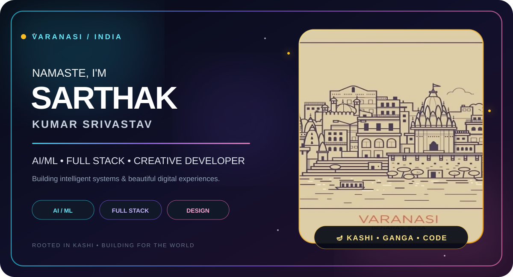

<div align="center">



<br><br>

<a href="https://github.com/its-sarthak-27">

</a>

<a href="https://www.linkedin.com/in/sarthak-kumar-srivastav-b80050361/">

</a>

<a href="https://www.instagram.com/its.sarthak.27">

</a>

</div>

<br>

---

<div align="center">

# 👋 Hey, I'm Sarthak

### `AI/ML Engineer • Full Stack Developer • Creative Builder`


</div>

---

# 🌈 ABOUT ME

<table>
<tr>

<td width="60%" valign="top">

I'm a developer passionate about building things that combine:

### 🤖 Artificial Intelligence
Machine Learning • Deep Learning • Computer Vision

### ⚛️ Modern Development
React • Node.js • Python • APIs • Databases

### 🎨 Creative Technology
UI/UX • Motion • Interactive Interfaces

I love taking an idea from:

**💡 Idea → 🎨 Design → 💻 Code → 🚀 Product**

<br>

> ### "Build something useful.  
> Make it beautiful.  
> Make it memorable."

</td>

<td width="40%" align="center">


<br>

### 🪔 Varanasi, India

`Roots ↓`

`Curiosity ↓`

`Code ↓`

`Future`

</td>

</tr>
</table>

---

# ⚡ WHAT I DO

<div align="center">

| 🤖 AI / ML | ⚛️ DEVELOPMENT | 🎨 DESIGN | 🚀 BUILDING |
|:---:|:---:|:---:|:---:|
| Machine Learning | React | UI/UX | Real Products |
| Deep Learning | Node.js | Motion Design | Startups |
| Computer Vision | Python | Creative UI | Experiments |
| AI Systems | APIs | Visual Design | Open Source |

</div>

---

# 🧠 TECHNOLOGY UNIVERSE

<div align="center">


<br><br>


<br><br>


</div>

<br>

<div align="center">

### ⚡ Languages

`Python` `C++` `Java` `JavaScript` `TypeScript`

### 🎨 Frontend

`React` `Vite` `Tailwind CSS` `Framer Motion`

### 🧠 Backend

`Node.js` `Express` `Python` `REST APIs`

### 🗄️ Database

`MongoDB` `MySQL`

### 🛠️ Tools

`Git` `GitHub` `VS Code` `Figma` `Vercel`

</div>

---

# 🚀 FEATURED PROJECTS

<table>

<tr>

<td width="50%" valign="top">

## 🌧️ VARSHA-SETU

### Urban Flood Nowcasting

AI + GIS based urban flood intelligence system focused on short-term flood nowcasting and disaster management.

**Technologies**

`Python` `AI/ML` `React` `GIS` `SWMM`

### 🎯 Goal

Help understand rainfall-driven urban flooding and safer movement during extreme weather.

</td>

<td width="50%" valign="top">

## 👗 DREAMY DRAPES

### Fashion Discovery Platform

A Pinterest-inspired fashion discovery and affiliate platform.

**Technologies**

`React` `Vite` `Tailwind` `Node.js` `MongoDB`

### 🎯 Goal

Make fashion discovery visual, simple and engaging.

🌐 **[Live Website](https://dreamy-drapes-klgx.vercel.app)**

</td>

</tr>

<tr>

<td width="50%" valign="top">

## 🔥 FIRE & SMOKE AI

### Real-Time Detection

Computer vision system for detecting fire and smoke from video streams.

**Technologies**

`Python` `YOLO` `OpenCV` `Deep Learning`

### 🎯 Goal

Real-time detection + alerts + event logging.

</td>

<td width="50%" valign="top">

## 🧪 EXPERIMENT LAB

### Always Building

Small experiments, UI concepts, AI prototypes, algorithms and ideas.

**Status**

`BUILDING...`

`LEARNING...`

`ITERATING...`

`SHIPPING...`

</td>

</tr>

</table>

---

# 📊 GITHUB ANALYTICS

<div align="center">


<br><br>


</div>

---

# 🐍 CONTRIBUTION JOURNEY

<div align="center">


</div>

---

# 🎯 CURRENTLY WORKING ON

<div align="center">

```text
╭──────────────────────────────────────────────────╮
│                                                  │
│   🤖  Artificial Intelligence                    │
│                                                  │
│   👁️  Computer Vision                            │
│                                                  │
│   ⚛️  Advanced React Applications                │
│                                                  │
│   🧠  Data Structures & Algorithms               │
│                                                  │
│   🎨  Premium UI / UX                            │
│                                                  │
│   🌍  Real-World Digital Products                │
│                                                  │
╰──────────────────────────────────────────────────╯
